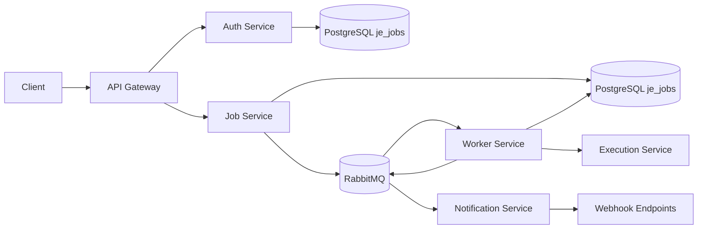

# JobEngine System Guide (Easy + Step-by-Step Testing)

## 1) What JobEngine is

JobEngine is a distributed job processing platform.

You submit jobs quickly through an API, and background workers execute them reliably.

Main parts:

- API Gateway (YARP): single public entry point.
- Auth Service: tenant/user auth and API keys.
- Job Service: stores jobs and publishes `JobSubmittedEvent`.
- Worker Service: consumes submitted jobs, calls Execution Service, updates job status.
- Execution Service: executes job handlers by job type.
- Notification Service: consumes completion/failure events and sends webhooks.
- Infra: PostgreSQL, RabbitMQ, Redis, Prometheus, Grafana.

## 2) End-to-end flow in plain English



1. Client authenticates and gets JWT from Auth Service.
2. Client submits job to Job Service.
3. Job Service writes job to DB, then publishes `JobSubmittedEvent`.
4. Worker Service consumes event, claims job safely, calls Execution Service.
5. Execution Service runs the matching handler (`send-email`, `generate-report`, `data-sync`).
6. Worker marks job completed/failed and publishes `JobCompletedEvent` or `JobFailedEvent`.
7. Notification Service consumes those events and delivers signed webhooks.

## 3) Prerequisites

- .NET 10 SDK
- Docker Desktop (or Docker Engine)
- curl (or Postman)

Optional but useful:

- RabbitMQ UI: http://localhost:15672 (guest/guest)
- Grafana: http://localhost:3001
- Prometheus: http://localhost:9090

## 4) Start everything quickly (recommended)

From repository root:

```bash
docker compose up --build
```

Core ports in compose:

- Gateway: `http://localhost:8080`
- Auth Service: `http://localhost:8082`
- Job Service: `http://localhost:8081`
- Execution Service: `http://localhost:8084`

## 5) Service-by-service testing

## 5.1 API Gateway (YARP)

Purpose: routes client traffic to backend services and adds correlation ID.

Health check:

```bash
curl -i http://localhost:8080/health
```

Expected:

- `200 OK`

Route smoke test (Auth path through gateway):

```bash
curl -i http://localhost:8080/api/v1/auth/login
```

Expected:

- You should get an Auth-service-style response (likely validation error for missing body).
- This confirms routing path is active.

## 5.2 Auth Service

Base route: `/api/v1/auth`

### Step A: Register tenant + admin

```bash
curl -s -X POST http://localhost:8080/api/v1/auth/register \
  -H "Content-Type: application/json" \
  -d '{
    "tenantName": "Acme Inc",
    "slug": "acme",
    "adminEmail": "admin@acme.test",
    "adminPassword": "P@ssw0rd123!"
  }'
```

Expected:

- `201` response with tenant and token details.

### Step B: Login

```bash
curl -s -X POST http://localhost:8080/api/v1/auth/login \
  -H "Content-Type: application/json" \
  -d '{
    "email": "admin@acme.test",
    "password": "P@ssw0rd123!",
    "tenantSlug": "acme"
  }'
```

Expected:

- `200` response with access token.
- Save `accessToken` for next steps.

### Step C: Create API key (optional)

```bash
curl -s -X POST http://localhost:8080/api/v1/auth/tenants/<TENANT_ID>/keys \
  -H "Authorization: Bearer <ACCESS_TOKEN>" \
  -H "Content-Type: application/json" \
  -d '{"name":"worker-key"}'
```

Expected:

- `201` and raw key returned once.

## 5.3 Job Service

Base route: `/api/v1/jobs`

### Step A: Submit a job

Use one of Execution Service supported types:

- `send-email`
- `generate-report`
- `data-sync`

Example (`send-email`):

```bash
curl -s -X POST http://localhost:8080/api/v1/jobs \
  -H "Authorization: Bearer <ACCESS_TOKEN>" \
  -H "Content-Type: application/json" \
  -d '{
    "type": "send-email",
    "payload": "{\"to\":\"demo@example.com\",\"subject\":\"Hello\",\"body\":\"Welcome\"}",
    "priority": 0,
    "maxAttempts": 3
  }'
```

Expected:

- `201 Created`
- body includes job id (GUID). Save it as `JOB_ID`.

### Step B: Read job status

```bash
curl -s http://localhost:8080/api/v1/jobs/<JOB_ID> \
  -H "Authorization: Bearer <ACCESS_TOKEN>"
```

Expected progression:

- `Queued` -> `Running` -> `Completed` (or `Failed`)

### Step C: List jobs

```bash
curl -s http://localhost:8080/api/v1/jobs \
  -H "Authorization: Bearer <ACCESS_TOKEN>"
```

Expected:

- list contains your job.

## 5.4 Worker Service

Purpose: consumes `JobSubmittedEvent`, performs idempotency/locking, calls Execution Service.

How to test:

1. Submit job (Job Service test above).
2. Check worker logs for sequence:
- consumed `JobSubmittedEvent`
- marked running
- execution call success/failure
- published completion/failure event

If running in Docker:

```bash
docker compose logs -f worker-service
```

Expected:

- log lines indicating handling of your `JOB_ID`.

## 5.5 Execution Service

Base route: `/api/v1`

### Step A: Health

```bash
curl -i http://localhost:8084/health
```

Expected:

- `200 OK`

### Step B: Direct execution API test

```bash
curl -s -X POST http://localhost:8084/api/v1/execute \
  -H "Content-Type: application/json" \
  -d '{
    "jobId": "11111111-1111-1111-1111-111111111111",
    "jobType": "generate-report",
    "payload": "{\"tenantId\":\"acme\",\"reportType\":\"daily\"}"
  }'
```

Expected:

- JSON response with:
- `success: true`
- `output` message
- `duration`

Negative test (unknown type):

```bash
curl -s -X POST http://localhost:8084/api/v1/execute \
  -H "Content-Type: application/json" \
  -d '{
    "jobId": "11111111-1111-1111-1111-111111111111",
    "jobType": "unknown-type",
    "payload": "{}"
  }'
```

Expected:

- `success: false`
- error saying no handler registered.

## 5.6 Notification Service

Purpose: consumes `JobCompletedEvent` / `JobFailedEvent` and sends HMAC-signed webhooks.

### Step A: Configure test webhook endpoint

In `backend/services/NotificationService/src/NotificationService/appsettings.Development.json`, add a `Webhooks` section.

Example:

```json
{
  "Logging": {
    "LogLevel": {
      "Default": "Information",
      "Microsoft.Hosting.Lifetime": "Information"
    }
  },
  "Webhooks": {
    "Endpoints": [
      {
        "Id": "wh-acme-1",
        "TenantId": "00000000-0000-0000-0000-000000000001",
        "Url": "https://webhook.site/your-unique-id",
        "Secret": "super-secret-demo",
        "Events": ["job.completed", "job.failed"],
        "IsActive": true
      }
    ]
  }
}
```

Important:

- `TenantId` must match the tenant that owns your test job.

### Step B: Trigger notification

1. Submit a job for that tenant.
2. Wait for worker completion.
3. Check Notification Service logs:

```bash
docker compose logs -f notification-service
```

Expected:

- log line for consuming completed/failed event
- webhook delivery attempts

### Step C: Verify webhook headers at receiver

Expected custom headers:

- `X-JobEngine-Event`
- `X-JobEngine-Signature` (sha256 HMAC)
- `X-JobEngine-Timestamp`

## 6) Full workflow test (one complete script-like flow)

1. Start stack:

```bash
docker compose up --build
```

2. Register + login on gateway Auth routes.
3. Save `TENANT_ID` and `ACCESS_TOKEN`.
4. Configure Notification webhook endpoint with same tenant ID.
5. Submit job (`send-email` or `generate-report`) through gateway.
6. Poll `GET /api/v1/jobs/<JOB_ID>` until terminal state.
7. Confirm Worker logs show consume -> execute -> publish.
8. Confirm Notification logs show consume -> deliver webhook.
9. Confirm webhook receiver got signed payload.

If all pass, your full JobEngine flow is healthy.

## 7) Build and test commands by service

From repo root, compile each service:

```bash
dotnet build backend/gateway/ApiGateway/ApiGateway.csproj
dotnet build backend/services/AuthService/src/AuthService.Api/AuthService.Api.csproj
dotnet build backend/services/JobService/src/JobService.Api/JobService.Api.csproj
dotnet build backend/services/WorkerService/src/WorkerService/WorkerService.csproj
dotnet build backend/services/ExecutionService/src/ExecutionService.Api/ExecutionService.Api.csproj
dotnet build backend/services/NotificationService/src/NotificationService/NotificationService.csproj
```

Run tests currently present:

```bash
dotnet test backend/tests/AuthService.Tests/AuthService.Tests.csproj
dotnet test backend/tests/JobService.Tests/JobService.Tests.csproj
dotnet test backend/tests/Integration.Tests/Integration.Tests.csproj
```

## 8) Troubleshooting quick guide

- Auth fails with 401:
- Ensure token is fresh and tenant claims are valid.

- Job remains queued:
- Check worker logs and RabbitMQ connectivity.

- Execution fails immediately:
- Ensure `jobType` matches one of supported handlers.
- Ensure payload JSON matches expected schema for the handler.

- No webhook delivered:
- Check Notification `Webhooks.Endpoints` config.
- Confirm tenant ID and event names match.
- Confirm receiver URL is reachable from container network.

## 9) What "healthy system" looks like

- Gateway `/health` returns 200.
- Auth register/login works.
- Job submit returns 201 and status transitions to terminal state.
- Worker logs show successful consume and execution lifecycle.
- Execution service returns success for known job types.
- Notification service emits webhook with HMAC headers.
- RabbitMQ queues are active with expected consumer counts.

---

This guide is designed so a new developer can validate the full JobEngine in under 30 minutes.
