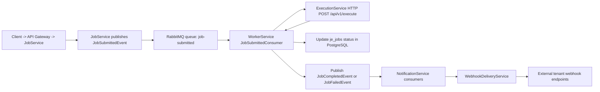

# Worker, Execution, and Notification Services: Deep Dive

This guide explains what these services do, how they connect, and what happens step-by-step when a job is submitted.

## 1) Big Picture

You already understand Auth and JobService create/list APIs. The missing part is what happens after JobService publishes the job event.



## 2) Shared Contracts (The Message Schema Everyone Uses)

Primary file:
- shared/Contracts/Events/JobSubmittedEvent.cs
- shared/Contracts/Events/JobCompletedEvent.cs
- shared/Contracts/Events/JobFailedEvent.cs

These files define:
- JobSubmittedEvent
- JobCompletedEvent
- JobFailedEvent

Why this matters:
- JobService publishes these types.
- WorkerService and NotificationService consume these exact types.
- Keeping contracts in shared prevents schema drift.

Example shape (from code):

```csharp
public sealed record JobSubmittedEvent
{
    public Guid JobId { get; init; }
    public Guid TenantId { get; init; }
    public string JobType { get; init; } = default!;
    public string Payload { get; init; } = "{}";
    public int Priority { get; init; }
    public int MaxAttempts { get; init; } = 3;
    public DateTime SubmittedAt { get; init; } = DateTime.UtcNow;
}
```

## 3) Where the Downstream Flow Starts (JobService Publish)

Key files:
- services/JobService/src/JobService.Application/Commands/SubmitJobCommand.cs
- services/JobService/src/JobService.Infrastructure/Messaging/MassTransitEventPublisher.cs

Important sequence in SubmitJobHandler:
1. Enforce tenant quota.
2. Create job domain aggregate.
3. Save to DB first.
4. Publish JobSubmittedEvent via IEventPublisher (MassTransit/IPublishEndpoint).
5. Mark job queued and save.

Logical takeaway:
- Database persists before event publish, so jobs are not lost if messaging has transient issues.

## 4) WorkerService Deep Dive

### 4.1 Startup and Wiring

Main startup file:
- services/WorkerService/src/WorkerService/Program.cs

What it configures:
- JobsDbContext (PostgreSQL je_jobs connection)
- MassTransit RabbitMQ consumer endpoint job-submitted
- Redis multiplexer and Redis database
- Distributed lock manager (RedisLockManager)
- HttpClient to ExecutionService (ExecutionService__Url)
- IJobStatusUpdater service

MassTransit behavior configured in Program.cs:
- Queue endpoint: job-submitted
- PrefetchCount = 5
- Exponential retry policy (3 attempts, growing delays)
- Dead letter binding for exhausted retries

### 4.2 Core Consumer Logic

Core file:
- services/WorkerService/src/WorkerService/Consumers/JobSubmittedConsumer.cs

This is the most important part. It does five major steps:

1. Idempotency guard in Redis
- Key: job:processed:{JobId}
- Uses SET NX with TTL (24h)
- If key already exists, duplicate message delivery is skipped safely.

2. Distributed lock in Redis
- Acquire lock key based on job id.
- Prevents race conditions if multiple workers contend for same job.

3. Mark Running in database
- Calls IJobStatusUpdater.MarkRunningAsync.
- Stores worker id for traceability.

4. Execute business handler via ExecutionService
- Calls IExecutionServiceClient.ExecuteAsync with JobId, JobType, Payload.
- Handles network/service failure and converts to failed result.

5. Persist terminal state and publish event
- Success path:
  - MarkCompletedAsync
  - Publish JobCompletedEvent
- Failure path:
  - MarkFailedAsync
  - Publish JobFailedEvent
  - Throws JobExecutionException if retry should continue

### 4.3 Locking Details

File:
- services/WorkerService/src/WorkerService/Locking/RedisLockManager.cs

Important details:
- Lock acquisition uses single atomic Redis SET NX with TTL.
- Lock renewal timer extends TTL for long-running jobs.
- Release uses Lua script to delete lock only if caller owns it.

This ownership check avoids deleting another worker's lock after expiration/reacquisition.

### 4.4 Execution Client

File:
- services/WorkerService/src/WorkerService/Clients/ExecutionServiceClient.cs

Behavior:
- Sends HTTP POST /api/v1/execute to ExecutionService.
- If non-2xx response, wraps HTTP status/body into failure ExecutionResult.
- Parses JSON response into ExecutionResult.

### 4.5 Job Status Writer

File:
- services/WorkerService/src/WorkerService/Services/JobStatusUpdater.cs

Behavior:
- Marks Running, Completed, Failed directly in JobsDbContext.
- Uses IgnoreQueryFilters() so worker can update jobs regardless of HTTP tenant filtering context.

### 4.6 Tenant Context in Worker

File:
- services/WorkerService/src/WorkerService/Services/WorkerTenantContext.cs

Behavior:
- Worker provides a non-user tenant context (Guid.Empty / "worker") for internal operations.

### 4.7 About Worker.cs and HeartbeatService

Files:
- services/WorkerService/src/WorkerService/Worker.cs
- services/WorkerService/src/WorkerService/Services/HeartbeatService.cs

Current state:
- Worker.cs is a template-style background loop.
- HeartbeatService logs pulses.
- The actual processing path used for jobs is JobSubmittedConsumer (MassTransit), not Worker.cs.

## 5) ExecutionService Deep Dive

### 5.1 Startup and DI

File:
- services/ExecutionService/src/ExecutionService.Api/Program.cs

Registers:
- Controllers
- Health checks
- IJobHandler implementations:
  - SendEmailHandler
  - GenerateReportHandler
  - DataSyncHandler
- JobHandlerRegistry

### 5.2 API Entry Point

File:
- services/ExecutionService/src/ExecutionService.Api/Controllers/ExecutionController.cs

Endpoint:
- POST /api/v1/execute

Behavior:
1. Receives ExecuteRequest(JobId, JobType, Payload).
2. Starts stopwatch.
3. Calls JobHandlerRegistry.ExecuteAsync(jobType, payload).
4. Returns ExecutionResult including Duration.

### 5.3 Handler Routing and Timeout

File:
- services/ExecutionService/src/ExecutionService.Core/Handlers/JobHandlerRegistry.cs

Key logic:
- Resolves handler dictionary by JobType (case-insensitive).
- Returns failure if job type missing or unregistered.
- Wraps execution in linked cancellation token with 5 minute timeout.
- Converts timeout/cancel/exception into structured ExecutionResult.Fail.

### 5.4 Concrete Handlers

Files:
- services/ExecutionService/src/ExecutionService.Core/Handlers/SendEmailHandler.cs
- services/ExecutionService/src/ExecutionService.Core/Handlers/GenerateReportHandler.cs
- services/ExecutionService/src/ExecutionService.Core/Handlers/DataSyncHandler.cs

Current implementation:
- Each deserializes payload JSON into typed record.
- Logs operation.
- Uses Task.Delay to simulate work.
- Returns output string.

Execution result model:
- services/ExecutionService/src/ExecutionService.Core/Models/ExecutionResult.cs

## 6) NotificationService Deep Dive

### 6.1 Startup and Wiring

File:
- services/NotificationService/src/NotificationService/Program.cs

Registers:
- MassTransit consumers for completed/failed events
- WebhookDeliveryService
- ConfigurationWebhookRepository
- HttpClient factory
- WebhookOptions from configuration section Webhooks

### 6.2 Event Consumers

File:
- services/NotificationService/src/NotificationService/Consumers/JobCompletedConsumer.cs

Contains two consumers:
- JobCompletedConsumer
- JobFailedConsumer

Behavior:
- JobCompletedConsumer always triggers webhook delivery with event type job.completed.
- JobFailedConsumer only triggers webhook when IsFinal is true (final dead-letter style failure).

Why IsFinal check exists:
- Avoid spamming webhooks for intermediate retry attempts.

### 6.3 Webhook Endpoint Repository

Files:
- services/NotificationService/src/NotificationService/Webhooks/IWebhookRepository.cs
- services/NotificationService/src/NotificationService/Webhooks/ConfigurationWebhookRepository.cs
- services/NotificationService/src/NotificationService/Webhooks/WebhookOptions.cs

Behavior:
- Reads endpoints from configuration.
- Filters by:
  - IsActive
  - TenantId
  - Event type match
  - Valid absolute URL

### 6.4 Webhook Delivery and Security

File:
- services/NotificationService/src/NotificationService/WebhookDeliveryService.cs

Delivery algorithm:
1. Serialize payload JSON.
2. Compute HMAC-SHA256 signature using endpoint secret.
3. Send POST with headers:
   - X-JobEngine-Event
   - X-JobEngine-Signature (sha256=...)
   - X-JobEngine-Timestamp
4. Retry with delays: immediate, 30s, 5m.
5. Log permanent failure if all attempts fail.

Security perspective:
- Receiver can recompute HMAC with shared secret and compare signature to verify authenticity and payload integrity.

## 7) End-to-End Step-by-Step (Single Job)

1. JobService receives create request and writes job row.
2. JobService publishes JobSubmittedEvent to RabbitMQ.
3. WorkerService consumes from job-submitted queue.
4. Worker enforces idempotency and distributed lock.
5. Worker marks job Running in je_jobs.
6. Worker calls ExecutionService /api/v1/execute.
7. ExecutionService resolves handler by JobType.
8. Handler executes and returns output/failure.
9. Worker marks Completed or Failed in database.
10. Worker publishes JobCompletedEvent or JobFailedEvent.
11. NotificationService consumes outcome event.
12. NotificationService sends signed webhook to tenant endpoints.

## 8) Infra and Runtime Configuration You Should Know

Docker composition references:
- docker-compose.yml

Notable settings:
- worker-service deploy replicas set to 3 (competing consumers).
- worker-service requires:
  - RabbitMQ__Host
  - Redis__Connection
  - ExecutionService__Url
  - ConnectionStrings__Jobs
- execution-service exposes port 8084 externally in compose.
- notification-service subscribes to RabbitMQ and delivers external webhooks.

## 9) Practical Debug Checklist

When a job seems stuck, inspect in this order:
1. JobService published event?
   - Check submit flow logs and RabbitMQ queue depth.
2. Worker consumed event?
   - Check WorkerService logs around JobSubmittedConsumer.
3. Worker lock/idempotency blocked?
   - Inspect Redis keys for processed/lock patterns.
4. Execution call succeeded?
   - Check WorkerService HTTP error logs and ExecutionService logs.
5. Status updated in je_jobs?
   - Verify Running/Completed/Failed transition rows.
6. Notification fired?
   - Check NotificationService consumer and webhook delivery logs.

## 10) Quick Mental Model

- JobService = command API + job persistence + event publication.
- WorkerService = reliable orchestrator and state transition owner.
- ExecutionService = pluggable job-type executor.
- NotificationService = outcome fan-out to external systems via secure webhooks.

If you want, a next guide can map this into sequence diagrams for:
- happy path
- transient failure + retry
- final dead-letter + notification
